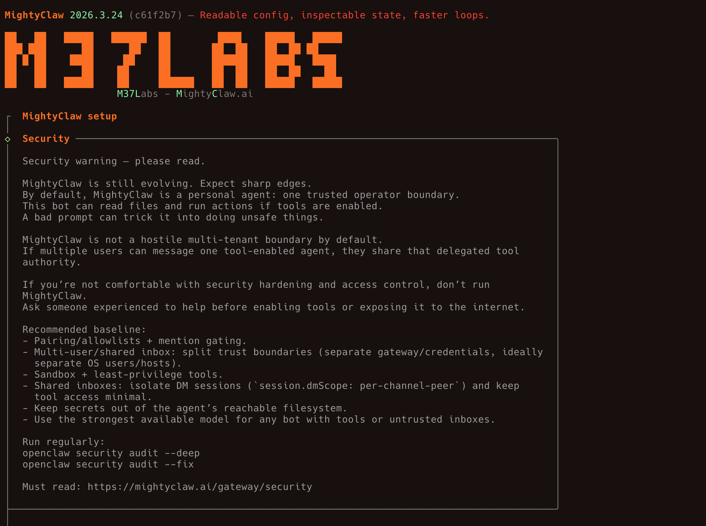

# MightyClaw



MightyClaw is a local-first personal agent system for real people, not just developers.

It gives you one control plane for your agent, your inboxes, your tools, and your devices. The goal is simple: reduce setup friction, make the system easier to understand, and help non-developer users adopt this kind of technology faster without hiding the real risks.

Website: https://mightyclaw.ai
Docs: https://mightyclaw.ai/start/getting-started
Security: https://mightyclaw.ai/security
Vision: VISION.md

## What This Project Is

MightyClaw lets you run your own agent stack on machines you control.

Today that includes:

- A local gateway that coordinates sessions, channels, tools, config, and UI.
- A web dashboard for day-to-day control.
- Terminal onboarding and configuration flows.
- Messaging connectors such as WhatsApp, Telegram, Slack, Discord, Signal, iMessage, and more.
- Agent tools for browser control, sessions, nodes, automation, and other local workflows.
- Companion device support across macOS, iOS, and Android.

## Why This Fork Exists

This fork is focused on one practical outcome: make the product easier to adopt.

That means:

- Cleaner branding and less confusing language.
- Better first-run experience in the terminal and dashboard.
- Simpler explanations of what the system does.
- A clearer path for non-developer users to get from install to a working setup.
- Honest defaults around safety, permissions, and operator control.

## Who It Is For

MightyClaw is a fit if you want:

- A personal agent that runs on your own machines.
- One place to manage channels, sessions, tools, and devices.
- A system you can grow from simple chat workflows into deeper automation.
- Local control instead of depending entirely on a hosted black box.

It is especially useful for:

- Operators.
- Technical founders.
- Power users.
- Small teams with one trusted operator.
- Non-developers who still want ownership, as long as someone can help with the first secure setup.

## What It Is Not

MightyClaw is not:

- A zero-risk consumer toy.
- A hosted SaaS that hides all system details.
- A default-safe multi-tenant platform.
- A promise that you never have to think about security.

If tools are enabled, the agent can read files and take actions. That power is the point, but it also means the system has to be configured carefully.

## Honest Status

This repo is a rebrand and simplification effort in progress.

Today:

- The product language in this fork is moving to MightyClaw and M37Labs.
- The first-run terminal and dashboard experience have already been reworked.
- The underlying npm package name and CLI command are still `openclaw` for compatibility.

That means you will still install and run the existing package and command for now.

## Quick Start

Runtime baseline:

- Node 24 recommended.
- Node 22.16+ supported.
- macOS, Linux, or Windows via WSL2.

Install:

```bash
npm install -g openclaw@latest
```

Run onboarding:

```bash
openclaw onboard --install-daemon
```

Open the dashboard later:

```bash
openclaw dashboard --no-open
```

## First-Time User Path

If you are new, the simplest path is:

1. Install the CLI.
2. Run `openclaw onboard --install-daemon`.
3. Follow the guided setup for gateway auth, workspace, channels, and skills.
4. Open the dashboard and verify you can connect.
5. Add one channel first, not five.
6. Test a safe workflow before enabling more tools.

## Scope Today

MightyClaw already includes real platform depth.

Core scope:

- Local gateway control plane.
- Web dashboard and control UI.
- CLI onboarding, configure, doctor, status, update, and dashboard flows.
- Multi-session agent runtime.
- Skills and tool execution.
- Local and remote operating modes.

Channel scope:

- Personal and team messaging connectors.
- Routing by channel, peer, account, and agent.
- Shared inbox patterns with pairing and allowlists.

Device scope:

- macOS integration.
- iOS and Android device nodes.
- Browser and node-backed actions.
- Media, camera, screen, and notification workflows where supported.

## Security Reality

MightyClaw should be treated like a powerful local operator tool.

Read this before exposing it to real channels or real people:

- https://mightyclaw.ai/gateway/security

Good baseline rules:

- Start with one trusted operator.
- Keep tool access narrow.
- Use pairing and allowlists.
- Separate shared or risky setups from your main personal environment.
- Prefer the strongest available model for any tool-enabled workflow.
- Run health and security checks regularly.

Useful commands:

```bash
openclaw doctor
openclaw security audit --deep
openclaw security audit --fix
```

## Why Non-Developers Can Adopt It Faster

The project direction here is not to hide complexity with marketing language.
It is to move complexity into clearer defaults, guided onboarding, better wording, and better control surfaces.

The adoption strategy is:

- Keep setup guided.
- Keep language plain.
- Show the operator what is happening.
- Reduce unnecessary terminology.
- Make recovery and troubleshooting obvious.
- Preserve a path from simple usage to advanced usage.

## From Source

If you want to run this repo directly:

```bash
git clone https://github.com/openclaw/openclaw.git
cd openclaw
pnpm install
pnpm ui:build
pnpm build
pnpm openclaw onboard --install-daemon
```

For local development:

```bash
pnpm gateway:watch
```

## Keep Dev Separate

If you use the official global OpenClaw install and this dev fork on the same machine, keep the environments separate.

Use these variables for the dev fork:

```bash
export OPENCLAW_HOME="$HOME"
export OPENCLAW_STATE_DIR="$HOME/.openclaw-dev"
export OPENCLAW_CONFIG_PATH="$HOME/.openclaw-dev/openclaw.json"
export OPENCLAW_PROFILE="devfork"
```

Clear them when switching back to the official install:

```bash
unset OPENCLAW_HOME OPENCLAW_STATE_DIR OPENCLAW_CONFIG_PATH OPENCLAW_PROFILE
```

## Contribution Direction

The contribution standard for this fork is practical clarity.

Good contributions:

- Simplify setup.
- Reduce confusion in naming.
- Improve onboarding.
- Make the dashboard more legible.
- Improve first-run success rate.
- Tighten security explanations without hand-waving.
- Make powerful features easier to approach without pretending they are harmless.

## Current Compatibility Note

Until the package and distribution rename is finished:

- npm package: `openclaw`
- CLI command: `openclaw`
- Some internal identifiers still use the old name

That is deliberate for now so installs, updates, and existing automation do not break.

## Project Objective

The objective of MightyClaw is not to be flashy.
The objective is to make personal agent infrastructure understandable, operable, and adoptable by more people.

If we do this well, a user should be able to:

- Install it.
- Understand what it is doing.
- Control it from one place.
- Grow into more advanced workflows over time.
- Do all of that without becoming a full-time infrastructure engineer.
